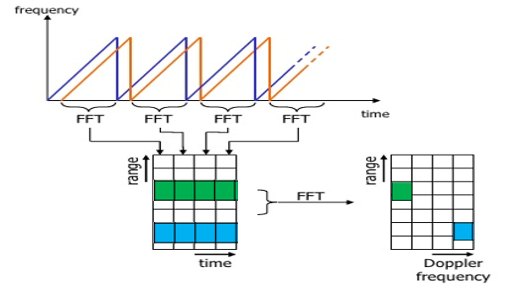

<<<<<<< HEAD
# SFND Radar Target Generation and Detection
  
<p style="color:black;font-size:14px;">

<em><br>Figure 1: Project layout to simulate Radar Target Generation and Detection (Source: Udacity)</em>
</p>
  
## Task
The idea of the Radar course in Udacity's Sensor Fusion Nanodegree program is to build a simplified simulation of the signal processing for target generation and detection of a Radar-based object detection system using [MATLAB](https://de.mathworks.com/products/matlab.html). Figure 1 shows the Radar project layout. This project consists of the following steps or sub-tasks, respectively:
  
* Define a simple Radar simulation scenario
* FMCW waveform generation for the specified Radar scenario
* Radar signal generation and moving target simulation
* Range measurement using FFT
* Generation of a Range Doppler Response Map
* Implementat 2D CIFAR on Range Doppler Response Map

The results need to meet the following [project requirements](https://review.udacity.com/#!/rubrics/2548/view).

## Define a simple Radar simulation scenario
Table 1 and 2 show the specifications and boundary conditions for the design of a simplified Radar simulation scenario in order to simulate the signal processing for target generation and detection of a Frequency Modulated Continuous Wave Radar system.

|Desired Radar signal properties|Symbol|Value and Unit|
|:------------------------------|:-------|:-------------|
|Operating carrier frequency|f_c|77 GHz|
|Speed of light|c|~3.0e8 m/s|
|Max. target detection range|r_t_max|200 m|
|Range resolution|r_t_res|1 m|
|Max. target velocity|v_t_max|70 m/s|
|Velocity resolution|v_t_res|3 m/s|
  
Table 1: Radar system requirements
  
|Target property|Symbol|Range and unit|
|:------------------------------|:-------|:-------------|
|Target range|r0_t|0...200 m|
|Target velocity|v0_t|-70...+70 m/s|
  
Table 2: Target requirements
  
User defined target distance and velocity
  
```
Initial state of our target object w. r. t. Radar sensor:
-------------------------------------------------------------
Initial target range       r_t_start = 1.1000e+02 m
Constant target velocity         v_t = -2.0000e+01 m/s
-------------------------------------------------------------
```
  
## FMCW waveform generation for the specified Radar scenario
Using the given system requirements the FMCW waveform parameters are derived including bandwidth (B_sweep or B_chirp), chirp time (T_sweep or T_chirp) and slope (slope) of the periodic chirp sweep signals shown in figure 2. For the given system requirements the calculated slope should be around 2e13.

<p style="color:black;font-size:14px;">

<em><br>Figure 2: FMCW waveforms with chirp parameters (Source: Udacity)</em>
</p>
  
The FMCW Radar chirp signal parameters are derived as follows from the given specifications:
  
```
% Wavelength of Radar carrier signal
lambda_c = c / f_c;  % [m]

% Maximum signal round trip time (time delay)
t_d_max = 2 * r_t_max / c;  % [s]

% Define sweep time based on the maximum signal round trip time. Usually,
% the sweep time of the linear FMCW chrip signal should be approx. 5...6 
% times the maximum signal round trip time.
T_sweep = 5.5 * 2 * r_t_max / c;  % [s]

% Derive bandwidth B_sweep of the FMCW chrip from the required range 
% resolution r_t_res = c / (2 * B_sweep).
B_sweep = c / (2 * r_t_res);  % [Hz]

% Derive maximum beat frequency from maximum detection range using the 
% similarity equation f_beat_max / ((2 * r_t_max) / c) = B_sweep / T_sweep.
f_beat_max = 2 * B_sweep * r_t_max / (c * T_sweep);   % [Hz]

% Calculate the slope of the FMCW chirp (linear frequency sweep).
sweepSlope = B_sweep / T_sweep;  % [Hz/s]

% Set number of Doppler cells or number of chirps in one sequence of the
% simulation according to the desired vecolity resolution. The whole range
% from -v_t_max to +v_t_max is covered by the number Doppler cells.
% Remark: Its ideal to have power of 2^ values to allow an application of
% the more efficient Fast Fourier Transform instead of Discrete Fourier 
% Transform.
Nd = 2^nextpow2(2 * v_t_max / v_t_res);

% Approximate maximum Doppler shift of the Radar signal frequency in [Hz]
f_Doppler_max = 2 * v_t_max / lambda_c;

% Get the maximum frequency to be resolved in order to drive the required
% sampling frequency. We also need to take the Nyquist criterion into 
% account as a minimum requirement.
% Remark: We ignore resolving the carrier frequency f_c here what will lead
% to aliasing effects in the simulation! We will take this effect as noise.
% f_max = max([(f_beat_max + f_Doppler_max), B_sweep]);  % [Hz]
f_max = f_beat_max + f_Doppler_max;  % [Hz]

% Derive the number of samples on each chirp sequence or the number of
% range cells as power of 2^ to allow an application of the more efficient 
% Fast Fourier Transform instead of Discrete Fourier Transform.
% Remark: The number of samples must be set more than twice as high as the
% maximum frequency to be resolved to satisfy the Nyquist criterion! 
Nr = 2^(nextpow2(T_sweep * f_max) + 1);

% Get actual sampling time and sampling frequency
Ts = T_sweep / Nr;  % [s]
fs = Nr / T_sweep;  % [Hz]
```
  
Selected sampling parameters to obtain at least a resolution of the max. beat frequency and the desired velocity resolution:
  
```
Sampling parameters:
-------------------------------------------------------------
Number of samples per sweep       Nr = 512
Number of sweep sequences         Nd = 64
Sampling time                     Ts = 1.4e-08 s
Sampling frequency                fs = 7.0e+07 Hz
-------------------------------------------------------------
```
  
Remark: Carrier frequency and max. sweep frequency are not resolved appropriately with these sampling parameters what causes aliasing effects. We will take these aliasing effects as noise in this simulation.
  
Resulting FMCW Radar waveform design using above parameters:
  
```
Waveform design of the FMCW Radar chirp signal:
-------------------------------------------------------------
Carrier frequency                f_c = 7.7000e+10 Hz
Carrier signal wavelength   lambda_c = 3.8934e-03 m
Maximum detection range      r_t_max = 200.0 m
Detection range resolution   r_t_res = 1.0 m
Max. signal round trip time  t_d_max = 1.3343e-06 s
Chirp sweep time             T_sweep = 7.3384e-06 s
Maximum chirp bandwidth      B_sweep = 1.4990e+08 Hz
Max beat frequency        f_beat_max = 2.7254e+07 Hz
Slope of linear chirp     sweepSlope = 2.0426e+13 Hz/s
Max. target velocity         v_t_max = 70.0000 m/s
Target velocity resolution   v_t_res = 2.2 m/s
Max. Doppler shift     f_Doppler_max = 3.5958e+04 Hz

Explanation
f_Doppler > 0: Target receding from Radar sensor
f_Doppler = 0: Const. distance between target & Radar sensor
f_Doppler < 0; Target approaching Radar sensor
-------------------------------------------------------------
```
  
<p style="color:black;font-size:14px;">

<em><br>Figure 3: Beat frequency and Doppler shift of the FMCW chirp signals (Source: Udacity)</em>
</p>

Figure 3 shows the beat frequency and the Doppler shift in the outgoing and the incoming chirp signal, which are shifted with respect to the time axis. The resulting Doppler shift using above waveform parameters and the given target velocity relative to the Radar sensor is shown below.

```
Actual Doppler shift for the target velocity:
-------------------------------------------------------------
Constant target velocity         v_t = -2.0000e+01 m/s

Actual Doppler shift       f_Doppler = -1.0274e+04 Hz

Explanation
f_Doppler > 0: Target receding from Radar sensor
f_Doppler = 0: Const. distance between target & Radar sensor
f_Doppler < 0; Target approaching Radar sensor
-------------------------------------------------------------
```
  
## Radar signal generation and moving target simulation
With the FMCW Radar signal waveform parameters we can simulate target movement and calculate the beat or mixed signal for every timestamp assuming ideal conditions. A beat signal should be generated such that once range FFT implemented, it gives the correct range i.e the initial position of target assigned with an error margin of +/- 10 meters at maximum. Figure 4 shows the formulae used for simulating signal propagation.
  
<p style="color:black;font-size:14px;">

<em><br>Figure 4: FMCW Radar signal modeling for a moving target(Source: Udacity)</em>
</p>
  
Signal generation and moving target simulation:
  
```
% Timestamps for running the displacement scenario for every sample on each
% periodic chirp signal sequence
t = linspace(0, Nd * T_sweep, Nr * Nd);  % [s]

% Instead of looping over all time samples in all Nd chirp sequences we
% simulate the target motion as well as the transmitted and the received 
% FMCW Radar signals using Matlab's more time-efficient matrix operations.

% Update the range of the target for each time stamp assuming a constant 
% target velocity.
r_t = r_t_start + v_t * t;  % [m]

% Get final target range
r_t_final = r_t(length(r_t));  % [m]

% Calculate signal round trip time or time delay between transceived and 
% received signal for each target range position
t_d = 2 * r_t / c;  % [s]

% For each time sample we need to calculate both the transmitted Radar 
% signal Tx and the received Radar signal Rx assuming a linear sine sweep.
Tx = cos(2 * pi * (f_c .* t + sweepSlope * t.^2 / 2));
Rx = cos(2 * pi * (f_c .* (t - t_d) + sweepSlope * (t - t_d).^2 / 2));
    
% Generate the Beat signal by mixing Transmit and Receive signal using
% elementwise matrix multiplication of Transmit and Receive signal
Mix = Tx .* Rx;

% Note: As we do not resolve the carrier frequency, or ignoring the Nyquist
% citerion for the carrier frequency, respectively, we get strong aliasing
% effects, which we take for noise in this simplified simulation!
```
  
<p style="color:black;font-size:14px;">

<em><br>Figure 5: Spectogram of the mixed or beat signal of the FMCW Radar (true target position ~ 110 m, beat frequency ~ 15 MHz)</em>
</p>
  
Figure 8 shows a spectrogram of the Beat Signal. We can observe high signal power at an approximately constant Beat Frequency over time (horizontal bright stripe at approx. 15 MHz). As the total simulated timeslot is quite small the target position does not vary much (s. below). Therefore, the Beat Frequency coming from the target is more or less constant, too.
  
```
Beat frequency for the initial and final target range:
-------------------------------------------------------------
Initial target range       r_t_start = 1.1000e+02 m
Final target range         r_t_final = 1.0999e+02 m

Initial beat frequency  f_beat_start = 1.4990e+07 Hz
Final beat frequency    f_beat_final = 1.4988e+07 Hz
-------------------------------------------------------------
```
  
## Range measurement using FFT
Figure 6, 7 and 8 show how to estimate the distance to one or multiple targets using beat frequency. The beat frequency can be detected from the frequency spectrum of a chirp sweep sequence of the mixed signal.
  
<p style="color:black;font-size:14px;">

<em><br>Figure 6: Range measuremnt between two vehicles using Radar (Source: Udacity)</em>
</p>
  
<p style="color:black;font-size:14px;">

<em><br>Figure 7: Range estimation using FMCW Radar (Source: Udacity)</em>
</p>
  
<p style="color:black;font-size:14px;">

<em><br>Figure 8: Beat frequency spectrum obtained from multiple targets using FMCW Radar (Source: Udacity)</em>
</p>
  
Next we implement the Range FFT on the Beat or Mixed Signal and plot the result. A correct implementation should generate a peak at the correct range, i.e the initial position of target assigned with an error margin of +/- 10 meters.
  
```
% Reshape the vector into Nr*Nd array. Nr and Nd here would also define the
% size of Range and Doppler FFT respectively.
X = reshape(Mix, [Nr, Nd]);

% Run the FFT on the beat signal along the range bins dimension (Nr), or
% along the columns, respectively, take the absolute value of the fft 
% output and normalize over the number of data points.
X_fft = abs(fft(X, Nr)) / Nr;

% The FFT provides an axis-symmetric spectrum from -fs/2 ... +fs/2 (where
% fs is the sampling frequency) with a symmetry axis going through f = 0.
% We only use the upper half from f = 0 ... +fs/2 and throw away the rest.
X_fft = X_fft(1 : Nr / 2 + 1, :);

% Define the frequency vector from f = 0 ... +fs/2 along the chirp or range
% axis, respectivly
f_fft = linspace(0, fs / 2, Nr / 2 + 1);

% Calculate signal power of each frequency component in [dB]
Px_fft = pow2db(X_fft .* conj(X_fft) / Nr);

% Calculate the range vector
range_fft = c * f_fft * T_sweep / (2 * B_sweep);

% Find the estimated target position (assumption: only one target peak 
% exists in this simulation).
r_t_est = range_fft(find(X_fft == max(X_fft), 1, 'first'));
```
  
<p style="color:black;font-size:14px;">

<em><br>Figure 9: Range estimation from signal power spectrum (true target position = 110 m)</em>
</p>
  
Figure 9 shows the signal power spectrum of the first chirp sequence of the beat or mixed signal. When testing for the frequency of the maximum peak in the spectrum, which is caused by our target we find the actual beat frequency and estimate the target range. 

Output of range estimation from signal power spectrum obtained from applying 1D FFT on the first chirp signal
  
```
Estimated target range using FFT of the first chirp signal:
-------------------------------------------------------------
Initial target range       r_t_start = 1.1000e+02 m
Estimated target range       r_t_est = 1.1000e+02 m
-------------------------------------------------------------
```
  
## Generation of a Range Doppler Response Map
The 2D CIFAR process (s. next task) runs on a Range Doppler Response Map, which is generated by doing a 2D FFT on a set of subsequent beat frequency signals (chirp output and received response) arranged in columns in a 2D matrix. The beat frequency signal is obtained by mixing the transmitted and the received FMCW Radar signals elementwise. Figure 10 shows the process of re-arranging sub-sequent chirp sequences into neighbouring columns of a 2D matrix. On this matrix we run the 2D FFT. Along the columns, respectively chirp sequence-wise, we obtain the range response. Along the rows, respectively across the chirp sequences, we obtain the Doppler response. The actual outcome from our simulation is shown in figure 11.
  
<p style="color:black;font-size:14px;">

<em><br>Figure 10: Application of 2D FFT on mixed signal re-arranged chirp sequence-wise in a 2D array (Source: Udacity))</em>
</p>

Application of 2D FFT on mixed signal re-arranged chirp sequence-wise in a 2D array:

```
% Reshape the mix signal vector into an Nr*Nd array. Nr and Nd here would 
% also define the size of Range and Doppler FFT respectively.
Mix = reshape(Mix, [Nr, Nd]);

% 2D FFT using the FFT size for both dimensions.
sig_fft2 = fft2(Mix, Nr, Nd);

% Shift zero Doppler frequency component to the center of the spectrum
sig_fft2 = fftshift(sig_fft2, 2);  % shift along Doppler axis only

% Taking just one side of signal from Range dimension.
sig_fft2 = sig_fft2(1 : Nr / 2 + 1, 1 : Nd);
RDM = abs(sig_fft2);
RDM = 10 * log10(RDM);

% Define the frequency vector from f = 0 ... +fs/2 along the chirp or range
% axis, respectivly
f_fft = linspace(0, fs / 2, Nr / 2 + 1);

% Define the Dopper frequency shift vector along the Doppler axis starting
% from min(f_Doppler) ... max(f_Doppler)
f_Doppler_fft = linspace(-1 / T_sweep / 2, 1 / T_sweep / 2, Nd);

% Use the surf function to plot the output of 2DFFT and to show axis in 
% both dimensions where range and Doppler axis are converted to represent
% estimated target distance and velocity, respectively
doppler_axis = f_Doppler_fft / 2 * lambda_c;
range_axis = c * f_fft * T_sweep / (2 * B_sweep);
```
  
<p style="color:black;font-size:14px;">

<em><br>Figure 11: Range Doppler MAP (true target position = 110 m, true target velocity = -20 m/s)</em>
</p>
  
A target hit by the transmitted Radar signals appears in the Range Doppler Map (s. figure 10) as a multi-variate Gaussian-like distribution with some standard deviation along the Range axis and some other standard deviation along the Doppler axis. The mean or center of the Gaussian-like peak yields the range or distance as well as the velocity estimate. The range estimate has been obtained in the previous chapter looking at a cut along the Range axis through this multi-variate Gaussian-like peak. For the velocity estimate we need to look at a cut along the Doppler axis. We can also use the center of the target cluster in the 2D CFAR map as shown in the next chapter.
  
## Implement 2D CIFAR on Range Doppler Response Map
The task in this step is to implement the 2D Constant False Alarm Rate (CFAR) process on the output of 2D FFT operation, i.e the Range Doppler Map, using dynamic thresholding to distinguish target responses from noise, or clutter, respectively. Figure 12 shows the effect of CFAR on a 1D signal corrupted with noise.
  
<p style="color:black;font-size:14px;">

<em><br>Figure 12: Estimating noise level using 1D CFAR on a signal with noise using different signal-to-noise offset thresholds in order to better distinguish target peaks from noise </em>
</p>
  
The 2D CFAR processing should be able to suppress the noise and clearly separate the target signals. Therefore, we have to define the number of guard and training cells in the CFAR sliding window around the cell under test (CUT) as is shown in figure 13.
  
<p style="color:black;font-size:14px;">

<em><br>Figure 13: 2D CFAR sliding window with guard cells and training cells arranged around the cell under test (CUT) </em>
</p>
    
When looking at the Range Doppler Map from figure 11, the frequency peak in the 2D spectrum shows a larger standard deviation (or uncertainty) in the Doppler axis direction than in the range axis direction with respect to the resolution of each peak by samples. The number of guard cells should be adapted to the expected size of target peaks for each axis. But as the number of spectral points is much smaller in Doppler direction than in range direction the number of guard cells in Doppler direction is anyway kept smaller then the number of guard cells in range direction. The number of training cells should be larger than the number of guard cells to cover both smaller and larger noise effects. Here the number of training cells was selected twice as large as the number of guard cells. If we increase / reduce the resolution along the range and/or Doppler axis, we can also increase / decrease the number of training and guard cells accordingly. In this case, the noise threshold was also increased a little bit from 5 to 8 dB in order to suppress false positive detections.
  
As we have only one target in this simulation we could also use much larger training cell numbers, but the larger the sliding window including both training and guard cells the poorer becomes the resolution between to neighbouring targets. We also need to keep a larger distance to the borders of our field of view assuming we always want to use the whole sliding window on both sides symmetric to the cell under test (CUT) for noise estimation. Therefore, enlarging the sliding window would shrink our overall field of view (unless we just used the inner half of the sliding window when it gets closer to the borders of our field of view). If we increase the resolution by increasing the sampling frequency and the number of chirp sequences to resolve for Doppler velocities we also have to increase the number of guard and training cells to take account for the changing properties in the frequency response maps. The frequency peaks are then formed by more samples.
    
The following steps are used to implement 2D-CFAR in MATLAB, where the training and guard cells are defined according to the dimensions of the Gaussian-like target peak in the Range Doppler Map as discussed above:
  
```
% Select the number of Training Cells in both the dimensions.
Tr = 16;  % range dimension
Td = 8;  % Doppler dimension

% Select the number of Guard Cells in both dimensions around the Cell under 
% Test (CUT) for accurate estimation
Gr = 8;  % range dimension
Gd = 4;  % Doppler dimension

% Offset the threshold by SNR value in dB
SNR_offset_dB = 8;

% Create a vector to store noise_level for each iteration on training cells
noise_level = zeros(1,1);

% The process above will generate a thresholded block, which is smaller 
% than the Range Doppler Map as the CUT cannot be located at the edges of
% matrix. Hence, few cells will not be thresholded. To keep the map size 
% same set those values to 0.
cfar2D = zeros(size(RDM));

% Width of the 2D CFAR sliding window in Range and Doppler dimension
wr = 2 * (Gr + Tr) + 1;
wd = 2 * (Gd + Td) + 1;

% 2D array to hold the threshold values
threshold_cfar = zeros(Nr / 2 + 1 - 2 * (Tr + Gr), Nd - 2 * (Td + Gd));

% 2D array to hold the final signal after thresholding
sig_cfar2D = zeros(Nr / 2 + 1 - 2 * (Tr + Gr), Nd - 2 * (Td + Gd));

% Generate 2D mesh grid the cfar threshold and filtered signal
[X_cfar,Y_cfar] = meshgrid((Td + Gd) : 1 : (Nd - (Td + Gd) - 1), ...
    (Tr + Gr) : 1 : (Nr / 2 + 1 - (Tr + Gr) - 1));

% Slide window across the rows of the 2D FFT RDM array where (i, j) 
% is the lower left starting point of the 2D sliding window
for i = 1 : (Nr/2+1 - wr + 1)
    
    % Slide window across the columns of the 2D FFT RDM array where (i, j) 
    % is the lower lewrft starting point of the 2D sliding window.
    for j = 1 : (Nd - wd + 1)
        
        % Determine the noise threshold by measuring the noise level in the
        % training cells (before/after as well as below/above the cell 
        % under test (CUT)) of the sliding window within the 2D FFT
        % converted from logarithmic to linear signal power.
        noise_level = ...
            sum(sum(db2pow(RDM(i : i + wr - 1, j : j + wd - 1)))) - ...
            sum(sum(db2pow(RDM(i + Tr : i + Tr + 2 * Gr + 1, ...
            j + Td : j + Td + 2 * Gd + 1))));
        
        % Number of training cells
        NT = wr * wd - (2 * Gr + 1) * (2 * Gd + 1);
        
        % To determine the noise threshold take the average of summed noise
        % over all training cells, convert it back to logarithmic signal
        % values and add the logarithmic SNR offset.
        threshold = pow2db(noise_level / NT) + SNR_offset_dB;
        threshold_cfar(i, j) = threshold;
          
        % Now pick the cell under test (CUT) right in the center of the 2D
        % sliding window which is Tr + Gr cells above and Td + Gd to the 
        % right of the lower left corner of the 2D sliding window and 
        % measure the signal level within the CUT.
        signal = RDM(Tr + Gr + i, Td + Gd + j);
        
        % Filter the signal above threshold: If the signal level at the 
        % cell under test (CUT) falls below the threshold assign it a 0 
        % value.
        if (signal < threshold)
            sig_cfar2D(i, j) = 0;
            cfar2D(Tr + Gr + i, Td + Gd + j) = 0;
        else
            sig_cfar2D(i, j) = signal;
            cfar2D(Tr + Gr + i, Td + Gd + j) = 1;
        end        
        
    end
    
end
```
  
<p style="color:black;font-size:14px;">

<em><br>Figure 14: Output from applying 2D CFAR on Range Doppler Map (true target position = 110 m, true target velocity = -20 m/s)</em>
</p>
  
Figure 14 shows the output from applying 2D CFAR on the Range Doppler Map obtained from 2D FFT on a set of beat signal sequences (s. figure 11). The bins that are identified to belong to the target response form a coherent cluster that corresponds to the cross-section of the Gaussian-like target peak in the Range Doppler Map, which is above the noise threshold level. When searching for the center of the cluster we can obtain a range and a velocity estimate of our target from the 2D CFAR output:
  
```
Estimated target range and velocity from 2D CFAR:
-------------------------------------------------------------
True average target range   r_t_mean = 1.1000e+02 m
Estimated target range       r_t_est = 1.1000e+02 m

True target velocity             v_t = -2.0000e+01 m/s
Estimated target velocity    v_t_est = -1.8948e+01 m/s
-------------------------------------------------------------
```
  
If we set the number of guard cells too low this cluster might fall apart into several peaks, and thus, could be falsely interpreted as multiple targets instead of a single one, which is not desired. Therefore, a larger protection zone around the cell under test with a sufficient number of guard cells is suitable in this case here. However, the larger the CFAR sliding window the larger is the minimum resolvable distance between two neighbouring targets as already stated above. Therefore, we have to make a compromise between a robust target identification and the minimum possible resolution between targets w. r. t. range and velocity.
  
=======
# SFND_Radar_Target_Generation_and_Detection
Radar detection and tracking simulation project from Udacity's nano degree course "Sensor Fusion" 
>>>>>>> d6738d93757a3832a87737e12ca25359da69955b
